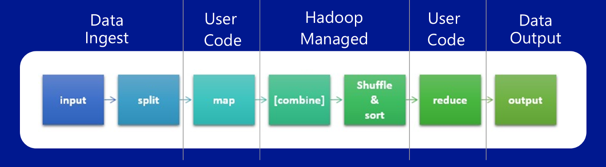
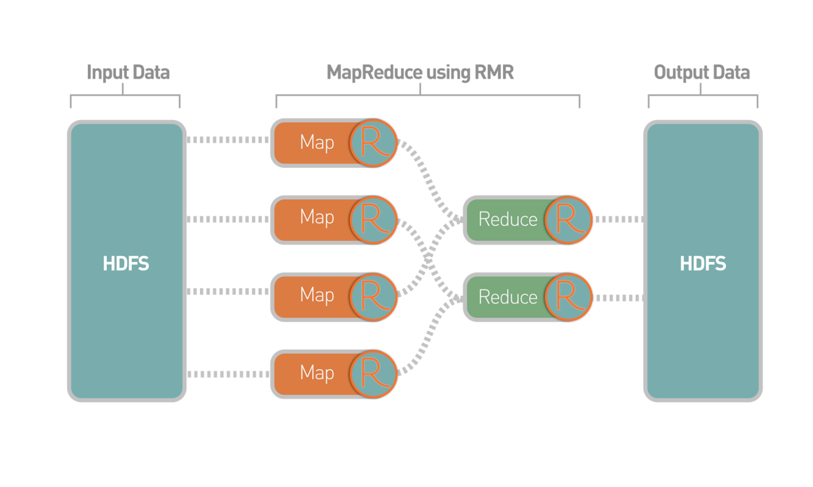

Introduction to Using R with Hadoop
========================================================
author: Andrie de Vries & Simon Field
date: 2015-07-01, UseR!2015
width: 1680
height: 1050
css: css/custom.css


About us
========================================================

Andrie de Vries
- Set up an independent market research firm in 2009
- Started using R
- Joined Revolution Analytics in 2013
- Author of ggdendro, checkpoint, miniCRAN packages
- Co-author of R for Dummies

***

Simon Field
- Career in high performance databases, including TeraData and Netezza
- Joined Revolution Analytics in 2013
- Responsible for Technical Pre-sales in Europe


Connecting to Azure with your browser
========================================================

http://ra-ldn-cluster-master-02.cloudapp.net:8787

Why Hadoop?
========================================================


Source: http://www.indeed.com/jobtrends?q=HTML5%2C+hadoop%2C+SAS&l=

Hype central
========================================================


Is your problem big enough for Hadoop?
================================================

When to use Hadoop?
* Conventional processing tools won’t work on your data
* Your data is really BIG
  - Won’t fit/process in your favourite database/file-system
* Your data is really diverse !
  - Semi-structured – JSON, XML, Logs, Images, Sounds
* You’re a wiz at programming

***
When not to use Hadoop?
* !(When to use Hadoop?)
* You’re in a hurry !


My job is reducing
==================


Hadoop logical flow
==================



Three main components
=====================

Hadoop                         | RHadoop project | github
-------                        | --------------  | ------
HDFS (distributed file system) | rhdfs  | ?
mapreduce (task manager)       | rmr2   | ?
hbase (database management)    | rhbase | ?


MapReduce
============
type: section

MapReduce
=========

A programming abstraction
* Applies to many types of big data calculation

Abstracts messy implementation detail in library
* Implicit parallelisation
* Load balancing
* Reduce data movement
* Robust job / machine failure management

MapReduce solves a generic problem
==================================

* Read a large amount of data
* MAP
* Extract a summary from each record
* Shuffle and sort
* REDUCE
* Aggregate, filter transform


The problem outline is generic – simply implement map and reduce to solve the problem at hand


rmr2
============
type: section

rmr2
============


MapReduce in R pseudo-code
==========================

In the mapper, v’ is available as data – no need for an explicit read statement


```r
mapper <- function(k, v){
  ...
  return(k’, v’)
}
```

In the reducer, all v’ with the same k’ is processed together


```r
reducer <- function(k’, v’){
  ...
  return(k’’, v’’)
}
```


Testing using the local backend
===============================

* The rmr2 package has a “local” back end, completely implemented in R
* This allows easy (and fast) testing before scaling to the “hadoop” backend


```r
rmr.options(backend = "local")
rmr.options(backend = "hadoop")
```

Sending data  R <---> Hadoop
============================

* The rmr2 package has 2 convenience functions that allow you to import / export a big.data.object into the R session


```r
to.dfs()
from.dfs()
```

Using the mapreduce() function
==============================

* Specify the input, map and reduce function
* Optionally, specify output, to persist result in hdfs
* If output = NULL, returns a temporary big.data.object


```r
x <- mapreduce(input, map, reduce, ...)
x()  # returns the file location
     # of the big.data.object
from.dfs(x) # available in R session
```


Demo 1: A first rmr2 script
===================
type: section

Demo 1
======


```r
library(rmr2)
library(rhdfs)
hdfs.init()

rmr.options(backend = "local")
```

```
NULL
```

```r
# rmr.options(backend.parameters = list("mapreduce.map.java.opts=-Xmx800M",
#                                       "mapreduce.reduce.java.opts=-Xmx800M"))
```


Demo 1
======


```r
x <- 1:1000
lapply(x, function(x)cbind(x, x^2))
```

```
[[1]]
     x  
[1,] 1 1

[[2]]
     x  
[1,] 2 4

[[3]]
     x  
[1,] 3 9

[[4]]
     x   
[1,] 4 16

[[5]]
     x   
[1,] 5 25

[[6]]
     x   
[1,] 6 36

[[7]]
     x   
[1,] 7 49

[[8]]
     x   
[1,] 8 64

[[9]]
     x   
[1,] 9 81

[[10]]
      x    
[1,] 10 100

[[11]]
      x    
[1,] 11 121

[[12]]
      x    
[1,] 12 144

[[13]]
      x    
[1,] 13 169

[[14]]
      x    
[1,] 14 196

[[15]]
      x    
[1,] 15 225

[[16]]
      x    
[1,] 16 256

[[17]]
      x    
[1,] 17 289

[[18]]
      x    
[1,] 18 324

[[19]]
      x    
[1,] 19 361

[[20]]
      x    
[1,] 20 400

[[21]]
      x    
[1,] 21 441

[[22]]
      x    
[1,] 22 484

[[23]]
      x    
[1,] 23 529

[[24]]
      x    
[1,] 24 576

[[25]]
      x    
[1,] 25 625

[[26]]
      x    
[1,] 26 676

[[27]]
      x    
[1,] 27 729

[[28]]
      x    
[1,] 28 784

[[29]]
      x    
[1,] 29 841

[[30]]
      x    
[1,] 30 900

[[31]]
      x    
[1,] 31 961

[[32]]
      x     
[1,] 32 1024

[[33]]
      x     
[1,] 33 1089

[[34]]
      x     
[1,] 34 1156

[[35]]
      x     
[1,] 35 1225

[[36]]
      x     
[1,] 36 1296

[[37]]
      x     
[1,] 37 1369

[[38]]
      x     
[1,] 38 1444

[[39]]
      x     
[1,] 39 1521

[[40]]
      x     
[1,] 40 1600

[[41]]
      x     
[1,] 41 1681

[[42]]
      x     
[1,] 42 1764

[[43]]
      x     
[1,] 43 1849

[[44]]
      x     
[1,] 44 1936

[[45]]
      x     
[1,] 45 2025

[[46]]
      x     
[1,] 46 2116

[[47]]
      x     
[1,] 47 2209

[[48]]
      x     
[1,] 48 2304

[[49]]
      x     
[1,] 49 2401

[[50]]
      x     
[1,] 50 2500

[[51]]
      x     
[1,] 51 2601

[[52]]
      x     
[1,] 52 2704

[[53]]
      x     
[1,] 53 2809

[[54]]
      x     
[1,] 54 2916

[[55]]
      x     
[1,] 55 3025

[[56]]
      x     
[1,] 56 3136

[[57]]
      x     
[1,] 57 3249

[[58]]
      x     
[1,] 58 3364

[[59]]
      x     
[1,] 59 3481

[[60]]
      x     
[1,] 60 3600

[[61]]
      x     
[1,] 61 3721

[[62]]
      x     
[1,] 62 3844

[[63]]
      x     
[1,] 63 3969

[[64]]
      x     
[1,] 64 4096

[[65]]
      x     
[1,] 65 4225

[[66]]
      x     
[1,] 66 4356

[[67]]
      x     
[1,] 67 4489

[[68]]
      x     
[1,] 68 4624

[[69]]
      x     
[1,] 69 4761

[[70]]
      x     
[1,] 70 4900

[[71]]
      x     
[1,] 71 5041

[[72]]
      x     
[1,] 72 5184

[[73]]
      x     
[1,] 73 5329

[[74]]
      x     
[1,] 74 5476

[[75]]
      x     
[1,] 75 5625

[[76]]
      x     
[1,] 76 5776

[[77]]
      x     
[1,] 77 5929

[[78]]
      x     
[1,] 78 6084

[[79]]
      x     
[1,] 79 6241

[[80]]
      x     
[1,] 80 6400

[[81]]
      x     
[1,] 81 6561

[[82]]
      x     
[1,] 82 6724

[[83]]
      x     
[1,] 83 6889

[[84]]
      x     
[1,] 84 7056

[[85]]
      x     
[1,] 85 7225

[[86]]
      x     
[1,] 86 7396

[[87]]
      x     
[1,] 87 7569

[[88]]
      x     
[1,] 88 7744

[[89]]
      x     
[1,] 89 7921

[[90]]
      x     
[1,] 90 8100

[[91]]
      x     
[1,] 91 8281

[[92]]
      x     
[1,] 92 8464

[[93]]
      x     
[1,] 93 8649

[[94]]
      x     
[1,] 94 8836

[[95]]
      x     
[1,] 95 9025

[[96]]
      x     
[1,] 96 9216

[[97]]
      x     
[1,] 97 9409

[[98]]
      x     
[1,] 98 9604

[[99]]
      x     
[1,] 99 9801

[[100]]
       x      
[1,] 100 10000

[[101]]
       x      
[1,] 101 10201

[[102]]
       x      
[1,] 102 10404

[[103]]
       x      
[1,] 103 10609

[[104]]
       x      
[1,] 104 10816

[[105]]
       x      
[1,] 105 11025

[[106]]
       x      
[1,] 106 11236

[[107]]
       x      
[1,] 107 11449

[[108]]
       x      
[1,] 108 11664

[[109]]
       x      
[1,] 109 11881

[[110]]
       x      
[1,] 110 12100

[[111]]
       x      
[1,] 111 12321

[[112]]
       x      
[1,] 112 12544

[[113]]
       x      
[1,] 113 12769

[[114]]
       x      
[1,] 114 12996

[[115]]
       x      
[1,] 115 13225

[[116]]
       x      
[1,] 116 13456

[[117]]
       x      
[1,] 117 13689

[[118]]
       x      
[1,] 118 13924

[[119]]
       x      
[1,] 119 14161

[[120]]
       x      
[1,] 120 14400

[[121]]
       x      
[1,] 121 14641

[[122]]
       x      
[1,] 122 14884

[[123]]
       x      
[1,] 123 15129

[[124]]
       x      
[1,] 124 15376

[[125]]
       x      
[1,] 125 15625

[[126]]
       x      
[1,] 126 15876

[[127]]
       x      
[1,] 127 16129

[[128]]
       x      
[1,] 128 16384

[[129]]
       x      
[1,] 129 16641

[[130]]
       x      
[1,] 130 16900

[[131]]
       x      
[1,] 131 17161

[[132]]
       x      
[1,] 132 17424

[[133]]
       x      
[1,] 133 17689

[[134]]
       x      
[1,] 134 17956

[[135]]
       x      
[1,] 135 18225

[[136]]
       x      
[1,] 136 18496

[[137]]
       x      
[1,] 137 18769

[[138]]
       x      
[1,] 138 19044

[[139]]
       x      
[1,] 139 19321

[[140]]
       x      
[1,] 140 19600

[[141]]
       x      
[1,] 141 19881

[[142]]
       x      
[1,] 142 20164

[[143]]
       x      
[1,] 143 20449

[[144]]
       x      
[1,] 144 20736

[[145]]
       x      
[1,] 145 21025

[[146]]
       x      
[1,] 146 21316

[[147]]
       x      
[1,] 147 21609

[[148]]
       x      
[1,] 148 21904

[[149]]
       x      
[1,] 149 22201

[[150]]
       x      
[1,] 150 22500

[[151]]
       x      
[1,] 151 22801

[[152]]
       x      
[1,] 152 23104

[[153]]
       x      
[1,] 153 23409

[[154]]
       x      
[1,] 154 23716

[[155]]
       x      
[1,] 155 24025

[[156]]
       x      
[1,] 156 24336

[[157]]
       x      
[1,] 157 24649

[[158]]
       x      
[1,] 158 24964

[[159]]
       x      
[1,] 159 25281

[[160]]
       x      
[1,] 160 25600

[[161]]
       x      
[1,] 161 25921

[[162]]
       x      
[1,] 162 26244

[[163]]
       x      
[1,] 163 26569

[[164]]
       x      
[1,] 164 26896

[[165]]
       x      
[1,] 165 27225

[[166]]
       x      
[1,] 166 27556

[[167]]
       x      
[1,] 167 27889

[[168]]
       x      
[1,] 168 28224

[[169]]
       x      
[1,] 169 28561

[[170]]
       x      
[1,] 170 28900

[[171]]
       x      
[1,] 171 29241

[[172]]
       x      
[1,] 172 29584

[[173]]
       x      
[1,] 173 29929

[[174]]
       x      
[1,] 174 30276

[[175]]
       x      
[1,] 175 30625

[[176]]
       x      
[1,] 176 30976

[[177]]
       x      
[1,] 177 31329

[[178]]
       x      
[1,] 178 31684

[[179]]
       x      
[1,] 179 32041

[[180]]
       x      
[1,] 180 32400

[[181]]
       x      
[1,] 181 32761

[[182]]
       x      
[1,] 182 33124

[[183]]
       x      
[1,] 183 33489

[[184]]
       x      
[1,] 184 33856

[[185]]
       x      
[1,] 185 34225

[[186]]
       x      
[1,] 186 34596

[[187]]
       x      
[1,] 187 34969

[[188]]
       x      
[1,] 188 35344

[[189]]
       x      
[1,] 189 35721

[[190]]
       x      
[1,] 190 36100

[[191]]
       x      
[1,] 191 36481

[[192]]
       x      
[1,] 192 36864

[[193]]
       x      
[1,] 193 37249

[[194]]
       x      
[1,] 194 37636

[[195]]
       x      
[1,] 195 38025

[[196]]
       x      
[1,] 196 38416

[[197]]
       x      
[1,] 197 38809

[[198]]
       x      
[1,] 198 39204

[[199]]
       x      
[1,] 199 39601

[[200]]
       x      
[1,] 200 40000

[[201]]
       x      
[1,] 201 40401

[[202]]
       x      
[1,] 202 40804

[[203]]
       x      
[1,] 203 41209

[[204]]
       x      
[1,] 204 41616

[[205]]
       x      
[1,] 205 42025

[[206]]
       x      
[1,] 206 42436

[[207]]
       x      
[1,] 207 42849

[[208]]
       x      
[1,] 208 43264

[[209]]
       x      
[1,] 209 43681

[[210]]
       x      
[1,] 210 44100

[[211]]
       x      
[1,] 211 44521

[[212]]
       x      
[1,] 212 44944

[[213]]
       x      
[1,] 213 45369

[[214]]
       x      
[1,] 214 45796

[[215]]
       x      
[1,] 215 46225

[[216]]
       x      
[1,] 216 46656

[[217]]
       x      
[1,] 217 47089

[[218]]
       x      
[1,] 218 47524

[[219]]
       x      
[1,] 219 47961

[[220]]
       x      
[1,] 220 48400

[[221]]
       x      
[1,] 221 48841

[[222]]
       x      
[1,] 222 49284

[[223]]
       x      
[1,] 223 49729

[[224]]
       x      
[1,] 224 50176

[[225]]
       x      
[1,] 225 50625

[[226]]
       x      
[1,] 226 51076

[[227]]
       x      
[1,] 227 51529

[[228]]
       x      
[1,] 228 51984

[[229]]
       x      
[1,] 229 52441

[[230]]
       x      
[1,] 230 52900

[[231]]
       x      
[1,] 231 53361

[[232]]
       x      
[1,] 232 53824

[[233]]
       x      
[1,] 233 54289

[[234]]
       x      
[1,] 234 54756

[[235]]
       x      
[1,] 235 55225

[[236]]
       x      
[1,] 236 55696

[[237]]
       x      
[1,] 237 56169

[[238]]
       x      
[1,] 238 56644

[[239]]
       x      
[1,] 239 57121

[[240]]
       x      
[1,] 240 57600

[[241]]
       x      
[1,] 241 58081

[[242]]
       x      
[1,] 242 58564

[[243]]
       x      
[1,] 243 59049

[[244]]
       x      
[1,] 244 59536

[[245]]
       x      
[1,] 245 60025

[[246]]
       x      
[1,] 246 60516

[[247]]
       x      
[1,] 247 61009

[[248]]
       x      
[1,] 248 61504

[[249]]
       x      
[1,] 249 62001

[[250]]
       x      
[1,] 250 62500

[[251]]
       x      
[1,] 251 63001

[[252]]
       x      
[1,] 252 63504

[[253]]
       x      
[1,] 253 64009

[[254]]
       x      
[1,] 254 64516

[[255]]
       x      
[1,] 255 65025

[[256]]
       x      
[1,] 256 65536

[[257]]
       x      
[1,] 257 66049

[[258]]
       x      
[1,] 258 66564

[[259]]
       x      
[1,] 259 67081

[[260]]
       x      
[1,] 260 67600

[[261]]
       x      
[1,] 261 68121

[[262]]
       x      
[1,] 262 68644

[[263]]
       x      
[1,] 263 69169

[[264]]
       x      
[1,] 264 69696

[[265]]
       x      
[1,] 265 70225

[[266]]
       x      
[1,] 266 70756

[[267]]
       x      
[1,] 267 71289

[[268]]
       x      
[1,] 268 71824

[[269]]
       x      
[1,] 269 72361

[[270]]
       x      
[1,] 270 72900

[[271]]
       x      
[1,] 271 73441

[[272]]
       x      
[1,] 272 73984

[[273]]
       x      
[1,] 273 74529

[[274]]
       x      
[1,] 274 75076

[[275]]
       x      
[1,] 275 75625

[[276]]
       x      
[1,] 276 76176

[[277]]
       x      
[1,] 277 76729

[[278]]
       x      
[1,] 278 77284

[[279]]
       x      
[1,] 279 77841

[[280]]
       x      
[1,] 280 78400

[[281]]
       x      
[1,] 281 78961

[[282]]
       x      
[1,] 282 79524

[[283]]
       x      
[1,] 283 80089

[[284]]
       x      
[1,] 284 80656

[[285]]
       x      
[1,] 285 81225

[[286]]
       x      
[1,] 286 81796

[[287]]
       x      
[1,] 287 82369

[[288]]
       x      
[1,] 288 82944

[[289]]
       x      
[1,] 289 83521

[[290]]
       x      
[1,] 290 84100

[[291]]
       x      
[1,] 291 84681

[[292]]
       x      
[1,] 292 85264

[[293]]
       x      
[1,] 293 85849

[[294]]
       x      
[1,] 294 86436

[[295]]
       x      
[1,] 295 87025

[[296]]
       x      
[1,] 296 87616

[[297]]
       x      
[1,] 297 88209

[[298]]
       x      
[1,] 298 88804

[[299]]
       x      
[1,] 299 89401

[[300]]
       x      
[1,] 300 90000

[[301]]
       x      
[1,] 301 90601

[[302]]
       x      
[1,] 302 91204

[[303]]
       x      
[1,] 303 91809

[[304]]
       x      
[1,] 304 92416

[[305]]
       x      
[1,] 305 93025

[[306]]
       x      
[1,] 306 93636

[[307]]
       x      
[1,] 307 94249

[[308]]
       x      
[1,] 308 94864

[[309]]
       x      
[1,] 309 95481

[[310]]
       x      
[1,] 310 96100

[[311]]
       x      
[1,] 311 96721

[[312]]
       x      
[1,] 312 97344

[[313]]
       x      
[1,] 313 97969

[[314]]
       x      
[1,] 314 98596

[[315]]
       x      
[1,] 315 99225

[[316]]
       x      
[1,] 316 99856

[[317]]
       x       
[1,] 317 100489

[[318]]
       x       
[1,] 318 101124

[[319]]
       x       
[1,] 319 101761

[[320]]
       x       
[1,] 320 102400

[[321]]
       x       
[1,] 321 103041

[[322]]
       x       
[1,] 322 103684

[[323]]
       x       
[1,] 323 104329

[[324]]
       x       
[1,] 324 104976

[[325]]
       x       
[1,] 325 105625

[[326]]
       x       
[1,] 326 106276

[[327]]
       x       
[1,] 327 106929

[[328]]
       x       
[1,] 328 107584

[[329]]
       x       
[1,] 329 108241

[[330]]
       x       
[1,] 330 108900

[[331]]
       x       
[1,] 331 109561

[[332]]
       x       
[1,] 332 110224

[[333]]
       x       
[1,] 333 110889

[[334]]
       x       
[1,] 334 111556

[[335]]
       x       
[1,] 335 112225

[[336]]
       x       
[1,] 336 112896

[[337]]
       x       
[1,] 337 113569

[[338]]
       x       
[1,] 338 114244

[[339]]
       x       
[1,] 339 114921

[[340]]
       x       
[1,] 340 115600

[[341]]
       x       
[1,] 341 116281

[[342]]
       x       
[1,] 342 116964

[[343]]
       x       
[1,] 343 117649

[[344]]
       x       
[1,] 344 118336

[[345]]
       x       
[1,] 345 119025

[[346]]
       x       
[1,] 346 119716

[[347]]
       x       
[1,] 347 120409

[[348]]
       x       
[1,] 348 121104

[[349]]
       x       
[1,] 349 121801

[[350]]
       x       
[1,] 350 122500

[[351]]
       x       
[1,] 351 123201

[[352]]
       x       
[1,] 352 123904

[[353]]
       x       
[1,] 353 124609

[[354]]
       x       
[1,] 354 125316

[[355]]
       x       
[1,] 355 126025

[[356]]
       x       
[1,] 356 126736

[[357]]
       x       
[1,] 357 127449

[[358]]
       x       
[1,] 358 128164

[[359]]
       x       
[1,] 359 128881

[[360]]
       x       
[1,] 360 129600

[[361]]
       x       
[1,] 361 130321

[[362]]
       x       
[1,] 362 131044

[[363]]
       x       
[1,] 363 131769

[[364]]
       x       
[1,] 364 132496

[[365]]
       x       
[1,] 365 133225

[[366]]
       x       
[1,] 366 133956

[[367]]
       x       
[1,] 367 134689

[[368]]
       x       
[1,] 368 135424

[[369]]
       x       
[1,] 369 136161

[[370]]
       x       
[1,] 370 136900

[[371]]
       x       
[1,] 371 137641

[[372]]
       x       
[1,] 372 138384

[[373]]
       x       
[1,] 373 139129

[[374]]
       x       
[1,] 374 139876

[[375]]
       x       
[1,] 375 140625

[[376]]
       x       
[1,] 376 141376

[[377]]
       x       
[1,] 377 142129

[[378]]
       x       
[1,] 378 142884

[[379]]
       x       
[1,] 379 143641

[[380]]
       x       
[1,] 380 144400

[[381]]
       x       
[1,] 381 145161

[[382]]
       x       
[1,] 382 145924

[[383]]
       x       
[1,] 383 146689

[[384]]
       x       
[1,] 384 147456

[[385]]
       x       
[1,] 385 148225

[[386]]
       x       
[1,] 386 148996

[[387]]
       x       
[1,] 387 149769

[[388]]
       x       
[1,] 388 150544

[[389]]
       x       
[1,] 389 151321

[[390]]
       x       
[1,] 390 152100

[[391]]
       x       
[1,] 391 152881

[[392]]
       x       
[1,] 392 153664

[[393]]
       x       
[1,] 393 154449

[[394]]
       x       
[1,] 394 155236

[[395]]
       x       
[1,] 395 156025

[[396]]
       x       
[1,] 396 156816

[[397]]
       x       
[1,] 397 157609

[[398]]
       x       
[1,] 398 158404

[[399]]
       x       
[1,] 399 159201

[[400]]
       x       
[1,] 400 160000

[[401]]
       x       
[1,] 401 160801

[[402]]
       x       
[1,] 402 161604

[[403]]
       x       
[1,] 403 162409

[[404]]
       x       
[1,] 404 163216

[[405]]
       x       
[1,] 405 164025

[[406]]
       x       
[1,] 406 164836

[[407]]
       x       
[1,] 407 165649

[[408]]
       x       
[1,] 408 166464

[[409]]
       x       
[1,] 409 167281

[[410]]
       x       
[1,] 410 168100

[[411]]
       x       
[1,] 411 168921

[[412]]
       x       
[1,] 412 169744

[[413]]
       x       
[1,] 413 170569

[[414]]
       x       
[1,] 414 171396

[[415]]
       x       
[1,] 415 172225

[[416]]
       x       
[1,] 416 173056

[[417]]
       x       
[1,] 417 173889

[[418]]
       x       
[1,] 418 174724

[[419]]
       x       
[1,] 419 175561

[[420]]
       x       
[1,] 420 176400

[[421]]
       x       
[1,] 421 177241

[[422]]
       x       
[1,] 422 178084

[[423]]
       x       
[1,] 423 178929

[[424]]
       x       
[1,] 424 179776

[[425]]
       x       
[1,] 425 180625

[[426]]
       x       
[1,] 426 181476

[[427]]
       x       
[1,] 427 182329

[[428]]
       x       
[1,] 428 183184

[[429]]
       x       
[1,] 429 184041

[[430]]
       x       
[1,] 430 184900

[[431]]
       x       
[1,] 431 185761

[[432]]
       x       
[1,] 432 186624

[[433]]
       x       
[1,] 433 187489

[[434]]
       x       
[1,] 434 188356

[[435]]
       x       
[1,] 435 189225

[[436]]
       x       
[1,] 436 190096

[[437]]
       x       
[1,] 437 190969

[[438]]
       x       
[1,] 438 191844

[[439]]
       x       
[1,] 439 192721

[[440]]
       x       
[1,] 440 193600

[[441]]
       x       
[1,] 441 194481

[[442]]
       x       
[1,] 442 195364

[[443]]
       x       
[1,] 443 196249

[[444]]
       x       
[1,] 444 197136

[[445]]
       x       
[1,] 445 198025

[[446]]
       x       
[1,] 446 198916

[[447]]
       x       
[1,] 447 199809

[[448]]
       x       
[1,] 448 200704

[[449]]
       x       
[1,] 449 201601

[[450]]
       x       
[1,] 450 202500

[[451]]
       x       
[1,] 451 203401

[[452]]
       x       
[1,] 452 204304

[[453]]
       x       
[1,] 453 205209

[[454]]
       x       
[1,] 454 206116

[[455]]
       x       
[1,] 455 207025

[[456]]
       x       
[1,] 456 207936

[[457]]
       x       
[1,] 457 208849

[[458]]
       x       
[1,] 458 209764

[[459]]
       x       
[1,] 459 210681

[[460]]
       x       
[1,] 460 211600

[[461]]
       x       
[1,] 461 212521

[[462]]
       x       
[1,] 462 213444

[[463]]
       x       
[1,] 463 214369

[[464]]
       x       
[1,] 464 215296

[[465]]
       x       
[1,] 465 216225

[[466]]
       x       
[1,] 466 217156

[[467]]
       x       
[1,] 467 218089

[[468]]
       x       
[1,] 468 219024

[[469]]
       x       
[1,] 469 219961

[[470]]
       x       
[1,] 470 220900

[[471]]
       x       
[1,] 471 221841

[[472]]
       x       
[1,] 472 222784

[[473]]
       x       
[1,] 473 223729

[[474]]
       x       
[1,] 474 224676

[[475]]
       x       
[1,] 475 225625

[[476]]
       x       
[1,] 476 226576

[[477]]
       x       
[1,] 477 227529

[[478]]
       x       
[1,] 478 228484

[[479]]
       x       
[1,] 479 229441

[[480]]
       x       
[1,] 480 230400

[[481]]
       x       
[1,] 481 231361

[[482]]
       x       
[1,] 482 232324

[[483]]
       x       
[1,] 483 233289

[[484]]
       x       
[1,] 484 234256

[[485]]
       x       
[1,] 485 235225

[[486]]
       x       
[1,] 486 236196

[[487]]
       x       
[1,] 487 237169

[[488]]
       x       
[1,] 488 238144

[[489]]
       x       
[1,] 489 239121

[[490]]
       x       
[1,] 490 240100

[[491]]
       x       
[1,] 491 241081

[[492]]
       x       
[1,] 492 242064

[[493]]
       x       
[1,] 493 243049

[[494]]
       x       
[1,] 494 244036

[[495]]
       x       
[1,] 495 245025

[[496]]
       x       
[1,] 496 246016

[[497]]
       x       
[1,] 497 247009

[[498]]
       x       
[1,] 498 248004

[[499]]
       x       
[1,] 499 249001

[[500]]
       x       
[1,] 500 250000

[[501]]
       x       
[1,] 501 251001

[[502]]
       x       
[1,] 502 252004

[[503]]
       x       
[1,] 503 253009

[[504]]
       x       
[1,] 504 254016

[[505]]
       x       
[1,] 505 255025

[[506]]
       x       
[1,] 506 256036

[[507]]
       x       
[1,] 507 257049

[[508]]
       x       
[1,] 508 258064

[[509]]
       x       
[1,] 509 259081

[[510]]
       x       
[1,] 510 260100

[[511]]
       x       
[1,] 511 261121

[[512]]
       x       
[1,] 512 262144

[[513]]
       x       
[1,] 513 263169

[[514]]
       x       
[1,] 514 264196

[[515]]
       x       
[1,] 515 265225

[[516]]
       x       
[1,] 516 266256

[[517]]
       x       
[1,] 517 267289

[[518]]
       x       
[1,] 518 268324

[[519]]
       x       
[1,] 519 269361

[[520]]
       x       
[1,] 520 270400

[[521]]
       x       
[1,] 521 271441

[[522]]
       x       
[1,] 522 272484

[[523]]
       x       
[1,] 523 273529

[[524]]
       x       
[1,] 524 274576

[[525]]
       x       
[1,] 525 275625

[[526]]
       x       
[1,] 526 276676

[[527]]
       x       
[1,] 527 277729

[[528]]
       x       
[1,] 528 278784

[[529]]
       x       
[1,] 529 279841

[[530]]
       x       
[1,] 530 280900

[[531]]
       x       
[1,] 531 281961

[[532]]
       x       
[1,] 532 283024

[[533]]
       x       
[1,] 533 284089

[[534]]
       x       
[1,] 534 285156

[[535]]
       x       
[1,] 535 286225

[[536]]
       x       
[1,] 536 287296

[[537]]
       x       
[1,] 537 288369

[[538]]
       x       
[1,] 538 289444

[[539]]
       x       
[1,] 539 290521

[[540]]
       x       
[1,] 540 291600

[[541]]
       x       
[1,] 541 292681

[[542]]
       x       
[1,] 542 293764

[[543]]
       x       
[1,] 543 294849

[[544]]
       x       
[1,] 544 295936

[[545]]
       x       
[1,] 545 297025

[[546]]
       x       
[1,] 546 298116

[[547]]
       x       
[1,] 547 299209

[[548]]
       x       
[1,] 548 300304

[[549]]
       x       
[1,] 549 301401

[[550]]
       x       
[1,] 550 302500

[[551]]
       x       
[1,] 551 303601

[[552]]
       x       
[1,] 552 304704

[[553]]
       x       
[1,] 553 305809

[[554]]
       x       
[1,] 554 306916

[[555]]
       x       
[1,] 555 308025

[[556]]
       x       
[1,] 556 309136

[[557]]
       x       
[1,] 557 310249

[[558]]
       x       
[1,] 558 311364

[[559]]
       x       
[1,] 559 312481

[[560]]
       x       
[1,] 560 313600

[[561]]
       x       
[1,] 561 314721

[[562]]
       x       
[1,] 562 315844

[[563]]
       x       
[1,] 563 316969

[[564]]
       x       
[1,] 564 318096

[[565]]
       x       
[1,] 565 319225

[[566]]
       x       
[1,] 566 320356

[[567]]
       x       
[1,] 567 321489

[[568]]
       x       
[1,] 568 322624

[[569]]
       x       
[1,] 569 323761

[[570]]
       x       
[1,] 570 324900

[[571]]
       x       
[1,] 571 326041

[[572]]
       x       
[1,] 572 327184

[[573]]
       x       
[1,] 573 328329

[[574]]
       x       
[1,] 574 329476

[[575]]
       x       
[1,] 575 330625

[[576]]
       x       
[1,] 576 331776

[[577]]
       x       
[1,] 577 332929

[[578]]
       x       
[1,] 578 334084

[[579]]
       x       
[1,] 579 335241

[[580]]
       x       
[1,] 580 336400

[[581]]
       x       
[1,] 581 337561

[[582]]
       x       
[1,] 582 338724

[[583]]
       x       
[1,] 583 339889

[[584]]
       x       
[1,] 584 341056

[[585]]
       x       
[1,] 585 342225

[[586]]
       x       
[1,] 586 343396

[[587]]
       x       
[1,] 587 344569

[[588]]
       x       
[1,] 588 345744

[[589]]
       x       
[1,] 589 346921

[[590]]
       x       
[1,] 590 348100

[[591]]
       x       
[1,] 591 349281

[[592]]
       x       
[1,] 592 350464

[[593]]
       x       
[1,] 593 351649

[[594]]
       x       
[1,] 594 352836

[[595]]
       x       
[1,] 595 354025

[[596]]
       x       
[1,] 596 355216

[[597]]
       x       
[1,] 597 356409

[[598]]
       x       
[1,] 598 357604

[[599]]
       x       
[1,] 599 358801

[[600]]
       x       
[1,] 600 360000

[[601]]
       x       
[1,] 601 361201

[[602]]
       x       
[1,] 602 362404

[[603]]
       x       
[1,] 603 363609

[[604]]
       x       
[1,] 604 364816

[[605]]
       x       
[1,] 605 366025

[[606]]
       x       
[1,] 606 367236

[[607]]
       x       
[1,] 607 368449

[[608]]
       x       
[1,] 608 369664

[[609]]
       x       
[1,] 609 370881

[[610]]
       x       
[1,] 610 372100

[[611]]
       x       
[1,] 611 373321

[[612]]
       x       
[1,] 612 374544

[[613]]
       x       
[1,] 613 375769

[[614]]
       x       
[1,] 614 376996

[[615]]
       x       
[1,] 615 378225

[[616]]
       x       
[1,] 616 379456

[[617]]
       x       
[1,] 617 380689

[[618]]
       x       
[1,] 618 381924

[[619]]
       x       
[1,] 619 383161

[[620]]
       x       
[1,] 620 384400

[[621]]
       x       
[1,] 621 385641

[[622]]
       x       
[1,] 622 386884

[[623]]
       x       
[1,] 623 388129

[[624]]
       x       
[1,] 624 389376

[[625]]
       x       
[1,] 625 390625

[[626]]
       x       
[1,] 626 391876

[[627]]
       x       
[1,] 627 393129

[[628]]
       x       
[1,] 628 394384

[[629]]
       x       
[1,] 629 395641

[[630]]
       x       
[1,] 630 396900

[[631]]
       x       
[1,] 631 398161

[[632]]
       x       
[1,] 632 399424

[[633]]
       x       
[1,] 633 400689

[[634]]
       x       
[1,] 634 401956

[[635]]
       x       
[1,] 635 403225

[[636]]
       x       
[1,] 636 404496

[[637]]
       x       
[1,] 637 405769

[[638]]
       x       
[1,] 638 407044

[[639]]
       x       
[1,] 639 408321

[[640]]
       x       
[1,] 640 409600

[[641]]
       x       
[1,] 641 410881

[[642]]
       x       
[1,] 642 412164

[[643]]
       x       
[1,] 643 413449

[[644]]
       x       
[1,] 644 414736

[[645]]
       x       
[1,] 645 416025

[[646]]
       x       
[1,] 646 417316

[[647]]
       x       
[1,] 647 418609

[[648]]
       x       
[1,] 648 419904

[[649]]
       x       
[1,] 649 421201

[[650]]
       x       
[1,] 650 422500

[[651]]
       x       
[1,] 651 423801

[[652]]
       x       
[1,] 652 425104

[[653]]
       x       
[1,] 653 426409

[[654]]
       x       
[1,] 654 427716

[[655]]
       x       
[1,] 655 429025

[[656]]
       x       
[1,] 656 430336

[[657]]
       x       
[1,] 657 431649

[[658]]
       x       
[1,] 658 432964

[[659]]
       x       
[1,] 659 434281

[[660]]
       x       
[1,] 660 435600

[[661]]
       x       
[1,] 661 436921

[[662]]
       x       
[1,] 662 438244

[[663]]
       x       
[1,] 663 439569

[[664]]
       x       
[1,] 664 440896

[[665]]
       x       
[1,] 665 442225

[[666]]
       x       
[1,] 666 443556

[[667]]
       x       
[1,] 667 444889

[[668]]
       x       
[1,] 668 446224

[[669]]
       x       
[1,] 669 447561

[[670]]
       x       
[1,] 670 448900

[[671]]
       x       
[1,] 671 450241

[[672]]
       x       
[1,] 672 451584

[[673]]
       x       
[1,] 673 452929

[[674]]
       x       
[1,] 674 454276

[[675]]
       x       
[1,] 675 455625

[[676]]
       x       
[1,] 676 456976

[[677]]
       x       
[1,] 677 458329

[[678]]
       x       
[1,] 678 459684

[[679]]
       x       
[1,] 679 461041

[[680]]
       x       
[1,] 680 462400

[[681]]
       x       
[1,] 681 463761

[[682]]
       x       
[1,] 682 465124

[[683]]
       x       
[1,] 683 466489

[[684]]
       x       
[1,] 684 467856

[[685]]
       x       
[1,] 685 469225

[[686]]
       x       
[1,] 686 470596

[[687]]
       x       
[1,] 687 471969

[[688]]
       x       
[1,] 688 473344

[[689]]
       x       
[1,] 689 474721

[[690]]
       x       
[1,] 690 476100

[[691]]
       x       
[1,] 691 477481

[[692]]
       x       
[1,] 692 478864

[[693]]
       x       
[1,] 693 480249

[[694]]
       x       
[1,] 694 481636

[[695]]
       x       
[1,] 695 483025

[[696]]
       x       
[1,] 696 484416

[[697]]
       x       
[1,] 697 485809

[[698]]
       x       
[1,] 698 487204

[[699]]
       x       
[1,] 699 488601

[[700]]
       x       
[1,] 700 490000

[[701]]
       x       
[1,] 701 491401

[[702]]
       x       
[1,] 702 492804

[[703]]
       x       
[1,] 703 494209

[[704]]
       x       
[1,] 704 495616

[[705]]
       x       
[1,] 705 497025

[[706]]
       x       
[1,] 706 498436

[[707]]
       x       
[1,] 707 499849

[[708]]
       x       
[1,] 708 501264

[[709]]
       x       
[1,] 709 502681

[[710]]
       x       
[1,] 710 504100

[[711]]
       x       
[1,] 711 505521

[[712]]
       x       
[1,] 712 506944

[[713]]
       x       
[1,] 713 508369

[[714]]
       x       
[1,] 714 509796

[[715]]
       x       
[1,] 715 511225

[[716]]
       x       
[1,] 716 512656

[[717]]
       x       
[1,] 717 514089

[[718]]
       x       
[1,] 718 515524

[[719]]
       x       
[1,] 719 516961

[[720]]
       x       
[1,] 720 518400

[[721]]
       x       
[1,] 721 519841

[[722]]
       x       
[1,] 722 521284

[[723]]
       x       
[1,] 723 522729

[[724]]
       x       
[1,] 724 524176

[[725]]
       x       
[1,] 725 525625

[[726]]
       x       
[1,] 726 527076

[[727]]
       x       
[1,] 727 528529

[[728]]
       x       
[1,] 728 529984

[[729]]
       x       
[1,] 729 531441

[[730]]
       x       
[1,] 730 532900

[[731]]
       x       
[1,] 731 534361

[[732]]
       x       
[1,] 732 535824

[[733]]
       x       
[1,] 733 537289

[[734]]
       x       
[1,] 734 538756

[[735]]
       x       
[1,] 735 540225

[[736]]
       x       
[1,] 736 541696

[[737]]
       x       
[1,] 737 543169

[[738]]
       x       
[1,] 738 544644

[[739]]
       x       
[1,] 739 546121

[[740]]
       x       
[1,] 740 547600

[[741]]
       x       
[1,] 741 549081

[[742]]
       x       
[1,] 742 550564

[[743]]
       x       
[1,] 743 552049

[[744]]
       x       
[1,] 744 553536

[[745]]
       x       
[1,] 745 555025

[[746]]
       x       
[1,] 746 556516

[[747]]
       x       
[1,] 747 558009

[[748]]
       x       
[1,] 748 559504

[[749]]
       x       
[1,] 749 561001

[[750]]
       x       
[1,] 750 562500

[[751]]
       x       
[1,] 751 564001

[[752]]
       x       
[1,] 752 565504

[[753]]
       x       
[1,] 753 567009

[[754]]
       x       
[1,] 754 568516

[[755]]
       x       
[1,] 755 570025

[[756]]
       x       
[1,] 756 571536

[[757]]
       x       
[1,] 757 573049

[[758]]
       x       
[1,] 758 574564

[[759]]
       x       
[1,] 759 576081

[[760]]
       x       
[1,] 760 577600

[[761]]
       x       
[1,] 761 579121

[[762]]
       x       
[1,] 762 580644

[[763]]
       x       
[1,] 763 582169

[[764]]
       x       
[1,] 764 583696

[[765]]
       x       
[1,] 765 585225

[[766]]
       x       
[1,] 766 586756

[[767]]
       x       
[1,] 767 588289

[[768]]
       x       
[1,] 768 589824

[[769]]
       x       
[1,] 769 591361

[[770]]
       x       
[1,] 770 592900

[[771]]
       x       
[1,] 771 594441

[[772]]
       x       
[1,] 772 595984

[[773]]
       x       
[1,] 773 597529

[[774]]
       x       
[1,] 774 599076

[[775]]
       x       
[1,] 775 600625

[[776]]
       x       
[1,] 776 602176

[[777]]
       x       
[1,] 777 603729

[[778]]
       x       
[1,] 778 605284

[[779]]
       x       
[1,] 779 606841

[[780]]
       x       
[1,] 780 608400

[[781]]
       x       
[1,] 781 609961

[[782]]
       x       
[1,] 782 611524

[[783]]
       x       
[1,] 783 613089

[[784]]
       x       
[1,] 784 614656

[[785]]
       x       
[1,] 785 616225

[[786]]
       x       
[1,] 786 617796

[[787]]
       x       
[1,] 787 619369

[[788]]
       x       
[1,] 788 620944

[[789]]
       x       
[1,] 789 622521

[[790]]
       x       
[1,] 790 624100

[[791]]
       x       
[1,] 791 625681

[[792]]
       x       
[1,] 792 627264

[[793]]
       x       
[1,] 793 628849

[[794]]
       x       
[1,] 794 630436

[[795]]
       x       
[1,] 795 632025

[[796]]
       x       
[1,] 796 633616

[[797]]
       x       
[1,] 797 635209

[[798]]
       x       
[1,] 798 636804

[[799]]
       x       
[1,] 799 638401

[[800]]
       x       
[1,] 800 640000

[[801]]
       x       
[1,] 801 641601

[[802]]
       x       
[1,] 802 643204

[[803]]
       x       
[1,] 803 644809

[[804]]
       x       
[1,] 804 646416

[[805]]
       x       
[1,] 805 648025

[[806]]
       x       
[1,] 806 649636

[[807]]
       x       
[1,] 807 651249

[[808]]
       x       
[1,] 808 652864

[[809]]
       x       
[1,] 809 654481

[[810]]
       x       
[1,] 810 656100

[[811]]
       x       
[1,] 811 657721

[[812]]
       x       
[1,] 812 659344

[[813]]
       x       
[1,] 813 660969

[[814]]
       x       
[1,] 814 662596

[[815]]
       x       
[1,] 815 664225

[[816]]
       x       
[1,] 816 665856

[[817]]
       x       
[1,] 817 667489

[[818]]
       x       
[1,] 818 669124

[[819]]
       x       
[1,] 819 670761

[[820]]
       x       
[1,] 820 672400

[[821]]
       x       
[1,] 821 674041

[[822]]
       x       
[1,] 822 675684

[[823]]
       x       
[1,] 823 677329

[[824]]
       x       
[1,] 824 678976

[[825]]
       x       
[1,] 825 680625

[[826]]
       x       
[1,] 826 682276

[[827]]
       x       
[1,] 827 683929

[[828]]
       x       
[1,] 828 685584

[[829]]
       x       
[1,] 829 687241

[[830]]
       x       
[1,] 830 688900

[[831]]
       x       
[1,] 831 690561

[[832]]
       x       
[1,] 832 692224

[[833]]
       x       
[1,] 833 693889

[[834]]
       x       
[1,] 834 695556

[[835]]
       x       
[1,] 835 697225

[[836]]
       x       
[1,] 836 698896

[[837]]
       x       
[1,] 837 700569

[[838]]
       x       
[1,] 838 702244

[[839]]
       x       
[1,] 839 703921

[[840]]
       x       
[1,] 840 705600

[[841]]
       x       
[1,] 841 707281

[[842]]
       x       
[1,] 842 708964

[[843]]
       x       
[1,] 843 710649

[[844]]
       x       
[1,] 844 712336

[[845]]
       x       
[1,] 845 714025

[[846]]
       x       
[1,] 846 715716

[[847]]
       x       
[1,] 847 717409

[[848]]
       x       
[1,] 848 719104

[[849]]
       x       
[1,] 849 720801

[[850]]
       x       
[1,] 850 722500

[[851]]
       x       
[1,] 851 724201

[[852]]
       x       
[1,] 852 725904

[[853]]
       x       
[1,] 853 727609

[[854]]
       x       
[1,] 854 729316

[[855]]
       x       
[1,] 855 731025

[[856]]
       x       
[1,] 856 732736

[[857]]
       x       
[1,] 857 734449

[[858]]
       x       
[1,] 858 736164

[[859]]
       x       
[1,] 859 737881

[[860]]
       x       
[1,] 860 739600

[[861]]
       x       
[1,] 861 741321

[[862]]
       x       
[1,] 862 743044

[[863]]
       x       
[1,] 863 744769

[[864]]
       x       
[1,] 864 746496

[[865]]
       x       
[1,] 865 748225

[[866]]
       x       
[1,] 866 749956

[[867]]
       x       
[1,] 867 751689

[[868]]
       x       
[1,] 868 753424

[[869]]
       x       
[1,] 869 755161

[[870]]
       x       
[1,] 870 756900

[[871]]
       x       
[1,] 871 758641

[[872]]
       x       
[1,] 872 760384

[[873]]
       x       
[1,] 873 762129

[[874]]
       x       
[1,] 874 763876

[[875]]
       x       
[1,] 875 765625

[[876]]
       x       
[1,] 876 767376

[[877]]
       x       
[1,] 877 769129

[[878]]
       x       
[1,] 878 770884

[[879]]
       x       
[1,] 879 772641

[[880]]
       x       
[1,] 880 774400

[[881]]
       x       
[1,] 881 776161

[[882]]
       x       
[1,] 882 777924

[[883]]
       x       
[1,] 883 779689

[[884]]
       x       
[1,] 884 781456

[[885]]
       x       
[1,] 885 783225

[[886]]
       x       
[1,] 886 784996

[[887]]
       x       
[1,] 887 786769

[[888]]
       x       
[1,] 888 788544

[[889]]
       x       
[1,] 889 790321

[[890]]
       x       
[1,] 890 792100

[[891]]
       x       
[1,] 891 793881

[[892]]
       x       
[1,] 892 795664

[[893]]
       x       
[1,] 893 797449

[[894]]
       x       
[1,] 894 799236

[[895]]
       x       
[1,] 895 801025

[[896]]
       x       
[1,] 896 802816

[[897]]
       x       
[1,] 897 804609

[[898]]
       x       
[1,] 898 806404

[[899]]
       x       
[1,] 899 808201

[[900]]
       x       
[1,] 900 810000

[[901]]
       x       
[1,] 901 811801

[[902]]
       x       
[1,] 902 813604

[[903]]
       x       
[1,] 903 815409

[[904]]
       x       
[1,] 904 817216

[[905]]
       x       
[1,] 905 819025

[[906]]
       x       
[1,] 906 820836

[[907]]
       x       
[1,] 907 822649

[[908]]
       x       
[1,] 908 824464

[[909]]
       x       
[1,] 909 826281

[[910]]
       x       
[1,] 910 828100

[[911]]
       x       
[1,] 911 829921

[[912]]
       x       
[1,] 912 831744

[[913]]
       x       
[1,] 913 833569

[[914]]
       x       
[1,] 914 835396

[[915]]
       x       
[1,] 915 837225

[[916]]
       x       
[1,] 916 839056

[[917]]
       x       
[1,] 917 840889

[[918]]
       x       
[1,] 918 842724

[[919]]
       x       
[1,] 919 844561

[[920]]
       x       
[1,] 920 846400

[[921]]
       x       
[1,] 921 848241

[[922]]
       x       
[1,] 922 850084

[[923]]
       x       
[1,] 923 851929

[[924]]
       x       
[1,] 924 853776

[[925]]
       x       
[1,] 925 855625

[[926]]
       x       
[1,] 926 857476

[[927]]
       x       
[1,] 927 859329

[[928]]
       x       
[1,] 928 861184

[[929]]
       x       
[1,] 929 863041

[[930]]
       x       
[1,] 930 864900

[[931]]
       x       
[1,] 931 866761

[[932]]
       x       
[1,] 932 868624

[[933]]
       x       
[1,] 933 870489

[[934]]
       x       
[1,] 934 872356

[[935]]
       x       
[1,] 935 874225

[[936]]
       x       
[1,] 936 876096

[[937]]
       x       
[1,] 937 877969

[[938]]
       x       
[1,] 938 879844

[[939]]
       x       
[1,] 939 881721

[[940]]
       x       
[1,] 940 883600

[[941]]
       x       
[1,] 941 885481

[[942]]
       x       
[1,] 942 887364

[[943]]
       x       
[1,] 943 889249

[[944]]
       x       
[1,] 944 891136

[[945]]
       x       
[1,] 945 893025

[[946]]
       x       
[1,] 946 894916

[[947]]
       x       
[1,] 947 896809

[[948]]
       x       
[1,] 948 898704

[[949]]
       x       
[1,] 949 900601

[[950]]
       x       
[1,] 950 902500

[[951]]
       x       
[1,] 951 904401

[[952]]
       x       
[1,] 952 906304

[[953]]
       x       
[1,] 953 908209

[[954]]
       x       
[1,] 954 910116

[[955]]
       x       
[1,] 955 912025

[[956]]
       x       
[1,] 956 913936

[[957]]
       x       
[1,] 957 915849

[[958]]
       x       
[1,] 958 917764

[[959]]
       x       
[1,] 959 919681

[[960]]
       x       
[1,] 960 921600

[[961]]
       x       
[1,] 961 923521

[[962]]
       x       
[1,] 962 925444

[[963]]
       x       
[1,] 963 927369

[[964]]
       x       
[1,] 964 929296

[[965]]
       x       
[1,] 965 931225

[[966]]
       x       
[1,] 966 933156

[[967]]
       x       
[1,] 967 935089

[[968]]
       x       
[1,] 968 937024

[[969]]
       x       
[1,] 969 938961

[[970]]
       x       
[1,] 970 940900

[[971]]
       x       
[1,] 971 942841

[[972]]
       x       
[1,] 972 944784

[[973]]
       x       
[1,] 973 946729

[[974]]
       x       
[1,] 974 948676

[[975]]
       x       
[1,] 975 950625

[[976]]
       x       
[1,] 976 952576

[[977]]
       x       
[1,] 977 954529

[[978]]
       x       
[1,] 978 956484

[[979]]
       x       
[1,] 979 958441

[[980]]
       x       
[1,] 980 960400

[[981]]
       x       
[1,] 981 962361

[[982]]
       x       
[1,] 982 964324

[[983]]
       x       
[1,] 983 966289

[[984]]
       x       
[1,] 984 968256

[[985]]
       x       
[1,] 985 970225

[[986]]
       x       
[1,] 986 972196

[[987]]
       x       
[1,] 987 974169

[[988]]
       x       
[1,] 988 976144

[[989]]
       x       
[1,] 989 978121

[[990]]
       x       
[1,] 990 980100

[[991]]
       x       
[1,] 991 982081

[[992]]
       x       
[1,] 992 984064

[[993]]
       x       
[1,] 993 986049

[[994]]
       x       
[1,] 994 988036

[[995]]
       x       
[1,] 995 990025

[[996]]
       x       
[1,] 996 992016

[[997]]
       x       
[1,] 997 994009

[[998]]
       x       
[1,] 998 996004

[[999]]
       x       
[1,] 999 998001

[[1000]]
        x      
[1,] 1000 1e+06
```

Demo 1
======


```r
small.ints = to.dfs(1:1000)

a <- mapreduce(
    input = small.ints,
    map = function(k, v) cbind(v, v^2)
)

a()
```

```
[1] "/tmp/RtmpULjWib/filef3a421a1ba9"
```

```r
from.dfs(a)
```

```
$key
NULL

$val
           v        
   [1,]    1       1
   [2,]    2       4
   [3,]    3       9
   [4,]    4      16
   [5,]    5      25
   [6,]    6      36
   [7,]    7      49
   [8,]    8      64
   [9,]    9      81
  [10,]   10     100
  [11,]   11     121
  [12,]   12     144
  [13,]   13     169
  [14,]   14     196
  [15,]   15     225
  [16,]   16     256
  [17,]   17     289
  [18,]   18     324
  [19,]   19     361
  [20,]   20     400
  [21,]   21     441
  [22,]   22     484
  [23,]   23     529
  [24,]   24     576
  [25,]   25     625
  [26,]   26     676
  [27,]   27     729
  [28,]   28     784
  [29,]   29     841
  [30,]   30     900
  [31,]   31     961
  [32,]   32    1024
  [33,]   33    1089
  [34,]   34    1156
  [35,]   35    1225
  [36,]   36    1296
  [37,]   37    1369
  [38,]   38    1444
  [39,]   39    1521
  [40,]   40    1600
  [41,]   41    1681
  [42,]   42    1764
  [43,]   43    1849
  [44,]   44    1936
  [45,]   45    2025
  [46,]   46    2116
  [47,]   47    2209
  [48,]   48    2304
  [49,]   49    2401
  [50,]   50    2500
  [51,]   51    2601
  [52,]   52    2704
  [53,]   53    2809
  [54,]   54    2916
  [55,]   55    3025
  [56,]   56    3136
  [57,]   57    3249
  [58,]   58    3364
  [59,]   59    3481
  [60,]   60    3600
  [61,]   61    3721
  [62,]   62    3844
  [63,]   63    3969
  [64,]   64    4096
  [65,]   65    4225
  [66,]   66    4356
  [67,]   67    4489
  [68,]   68    4624
  [69,]   69    4761
  [70,]   70    4900
  [71,]   71    5041
  [72,]   72    5184
  [73,]   73    5329
  [74,]   74    5476
  [75,]   75    5625
  [76,]   76    5776
  [77,]   77    5929
  [78,]   78    6084
  [79,]   79    6241
  [80,]   80    6400
  [81,]   81    6561
  [82,]   82    6724
  [83,]   83    6889
  [84,]   84    7056
  [85,]   85    7225
  [86,]   86    7396
  [87,]   87    7569
  [88,]   88    7744
  [89,]   89    7921
  [90,]   90    8100
  [91,]   91    8281
  [92,]   92    8464
  [93,]   93    8649
  [94,]   94    8836
  [95,]   95    9025
  [96,]   96    9216
  [97,]   97    9409
  [98,]   98    9604
  [99,]   99    9801
 [100,]  100   10000
 [101,]  101   10201
 [102,]  102   10404
 [103,]  103   10609
 [104,]  104   10816
 [105,]  105   11025
 [106,]  106   11236
 [107,]  107   11449
 [108,]  108   11664
 [109,]  109   11881
 [110,]  110   12100
 [111,]  111   12321
 [112,]  112   12544
 [113,]  113   12769
 [114,]  114   12996
 [115,]  115   13225
 [116,]  116   13456
 [117,]  117   13689
 [118,]  118   13924
 [119,]  119   14161
 [120,]  120   14400
 [121,]  121   14641
 [122,]  122   14884
 [123,]  123   15129
 [124,]  124   15376
 [125,]  125   15625
 [126,]  126   15876
 [127,]  127   16129
 [128,]  128   16384
 [129,]  129   16641
 [130,]  130   16900
 [131,]  131   17161
 [132,]  132   17424
 [133,]  133   17689
 [134,]  134   17956
 [135,]  135   18225
 [136,]  136   18496
 [137,]  137   18769
 [138,]  138   19044
 [139,]  139   19321
 [140,]  140   19600
 [141,]  141   19881
 [142,]  142   20164
 [143,]  143   20449
 [144,]  144   20736
 [145,]  145   21025
 [146,]  146   21316
 [147,]  147   21609
 [148,]  148   21904
 [149,]  149   22201
 [150,]  150   22500
 [151,]  151   22801
 [152,]  152   23104
 [153,]  153   23409
 [154,]  154   23716
 [155,]  155   24025
 [156,]  156   24336
 [157,]  157   24649
 [158,]  158   24964
 [159,]  159   25281
 [160,]  160   25600
 [161,]  161   25921
 [162,]  162   26244
 [163,]  163   26569
 [164,]  164   26896
 [165,]  165   27225
 [166,]  166   27556
 [167,]  167   27889
 [168,]  168   28224
 [169,]  169   28561
 [170,]  170   28900
 [171,]  171   29241
 [172,]  172   29584
 [173,]  173   29929
 [174,]  174   30276
 [175,]  175   30625
 [176,]  176   30976
 [177,]  177   31329
 [178,]  178   31684
 [179,]  179   32041
 [180,]  180   32400
 [181,]  181   32761
 [182,]  182   33124
 [183,]  183   33489
 [184,]  184   33856
 [185,]  185   34225
 [186,]  186   34596
 [187,]  187   34969
 [188,]  188   35344
 [189,]  189   35721
 [190,]  190   36100
 [191,]  191   36481
 [192,]  192   36864
 [193,]  193   37249
 [194,]  194   37636
 [195,]  195   38025
 [196,]  196   38416
 [197,]  197   38809
 [198,]  198   39204
 [199,]  199   39601
 [200,]  200   40000
 [201,]  201   40401
 [202,]  202   40804
 [203,]  203   41209
 [204,]  204   41616
 [205,]  205   42025
 [206,]  206   42436
 [207,]  207   42849
 [208,]  208   43264
 [209,]  209   43681
 [210,]  210   44100
 [211,]  211   44521
 [212,]  212   44944
 [213,]  213   45369
 [214,]  214   45796
 [215,]  215   46225
 [216,]  216   46656
 [217,]  217   47089
 [218,]  218   47524
 [219,]  219   47961
 [220,]  220   48400
 [221,]  221   48841
 [222,]  222   49284
 [223,]  223   49729
 [224,]  224   50176
 [225,]  225   50625
 [226,]  226   51076
 [227,]  227   51529
 [228,]  228   51984
 [229,]  229   52441
 [230,]  230   52900
 [231,]  231   53361
 [232,]  232   53824
 [233,]  233   54289
 [234,]  234   54756
 [235,]  235   55225
 [236,]  236   55696
 [237,]  237   56169
 [238,]  238   56644
 [239,]  239   57121
 [240,]  240   57600
 [241,]  241   58081
 [242,]  242   58564
 [243,]  243   59049
 [244,]  244   59536
 [245,]  245   60025
 [246,]  246   60516
 [247,]  247   61009
 [248,]  248   61504
 [249,]  249   62001
 [250,]  250   62500
 [251,]  251   63001
 [252,]  252   63504
 [253,]  253   64009
 [254,]  254   64516
 [255,]  255   65025
 [256,]  256   65536
 [257,]  257   66049
 [258,]  258   66564
 [259,]  259   67081
 [260,]  260   67600
 [261,]  261   68121
 [262,]  262   68644
 [263,]  263   69169
 [264,]  264   69696
 [265,]  265   70225
 [266,]  266   70756
 [267,]  267   71289
 [268,]  268   71824
 [269,]  269   72361
 [270,]  270   72900
 [271,]  271   73441
 [272,]  272   73984
 [273,]  273   74529
 [274,]  274   75076
 [275,]  275   75625
 [276,]  276   76176
 [277,]  277   76729
 [278,]  278   77284
 [279,]  279   77841
 [280,]  280   78400
 [281,]  281   78961
 [282,]  282   79524
 [283,]  283   80089
 [284,]  284   80656
 [285,]  285   81225
 [286,]  286   81796
 [287,]  287   82369
 [288,]  288   82944
 [289,]  289   83521
 [290,]  290   84100
 [291,]  291   84681
 [292,]  292   85264
 [293,]  293   85849
 [294,]  294   86436
 [295,]  295   87025
 [296,]  296   87616
 [297,]  297   88209
 [298,]  298   88804
 [299,]  299   89401
 [300,]  300   90000
 [301,]  301   90601
 [302,]  302   91204
 [303,]  303   91809
 [304,]  304   92416
 [305,]  305   93025
 [306,]  306   93636
 [307,]  307   94249
 [308,]  308   94864
 [309,]  309   95481
 [310,]  310   96100
 [311,]  311   96721
 [312,]  312   97344
 [313,]  313   97969
 [314,]  314   98596
 [315,]  315   99225
 [316,]  316   99856
 [317,]  317  100489
 [318,]  318  101124
 [319,]  319  101761
 [320,]  320  102400
 [321,]  321  103041
 [322,]  322  103684
 [323,]  323  104329
 [324,]  324  104976
 [325,]  325  105625
 [326,]  326  106276
 [327,]  327  106929
 [328,]  328  107584
 [329,]  329  108241
 [330,]  330  108900
 [331,]  331  109561
 [332,]  332  110224
 [333,]  333  110889
 [334,]  334  111556
 [335,]  335  112225
 [336,]  336  112896
 [337,]  337  113569
 [338,]  338  114244
 [339,]  339  114921
 [340,]  340  115600
 [341,]  341  116281
 [342,]  342  116964
 [343,]  343  117649
 [344,]  344  118336
 [345,]  345  119025
 [346,]  346  119716
 [347,]  347  120409
 [348,]  348  121104
 [349,]  349  121801
 [350,]  350  122500
 [351,]  351  123201
 [352,]  352  123904
 [353,]  353  124609
 [354,]  354  125316
 [355,]  355  126025
 [356,]  356  126736
 [357,]  357  127449
 [358,]  358  128164
 [359,]  359  128881
 [360,]  360  129600
 [361,]  361  130321
 [362,]  362  131044
 [363,]  363  131769
 [364,]  364  132496
 [365,]  365  133225
 [366,]  366  133956
 [367,]  367  134689
 [368,]  368  135424
 [369,]  369  136161
 [370,]  370  136900
 [371,]  371  137641
 [372,]  372  138384
 [373,]  373  139129
 [374,]  374  139876
 [375,]  375  140625
 [376,]  376  141376
 [377,]  377  142129
 [378,]  378  142884
 [379,]  379  143641
 [380,]  380  144400
 [381,]  381  145161
 [382,]  382  145924
 [383,]  383  146689
 [384,]  384  147456
 [385,]  385  148225
 [386,]  386  148996
 [387,]  387  149769
 [388,]  388  150544
 [389,]  389  151321
 [390,]  390  152100
 [391,]  391  152881
 [392,]  392  153664
 [393,]  393  154449
 [394,]  394  155236
 [395,]  395  156025
 [396,]  396  156816
 [397,]  397  157609
 [398,]  398  158404
 [399,]  399  159201
 [400,]  400  160000
 [401,]  401  160801
 [402,]  402  161604
 [403,]  403  162409
 [404,]  404  163216
 [405,]  405  164025
 [406,]  406  164836
 [407,]  407  165649
 [408,]  408  166464
 [409,]  409  167281
 [410,]  410  168100
 [411,]  411  168921
 [412,]  412  169744
 [413,]  413  170569
 [414,]  414  171396
 [415,]  415  172225
 [416,]  416  173056
 [417,]  417  173889
 [418,]  418  174724
 [419,]  419  175561
 [420,]  420  176400
 [421,]  421  177241
 [422,]  422  178084
 [423,]  423  178929
 [424,]  424  179776
 [425,]  425  180625
 [426,]  426  181476
 [427,]  427  182329
 [428,]  428  183184
 [429,]  429  184041
 [430,]  430  184900
 [431,]  431  185761
 [432,]  432  186624
 [433,]  433  187489
 [434,]  434  188356
 [435,]  435  189225
 [436,]  436  190096
 [437,]  437  190969
 [438,]  438  191844
 [439,]  439  192721
 [440,]  440  193600
 [441,]  441  194481
 [442,]  442  195364
 [443,]  443  196249
 [444,]  444  197136
 [445,]  445  198025
 [446,]  446  198916
 [447,]  447  199809
 [448,]  448  200704
 [449,]  449  201601
 [450,]  450  202500
 [451,]  451  203401
 [452,]  452  204304
 [453,]  453  205209
 [454,]  454  206116
 [455,]  455  207025
 [456,]  456  207936
 [457,]  457  208849
 [458,]  458  209764
 [459,]  459  210681
 [460,]  460  211600
 [461,]  461  212521
 [462,]  462  213444
 [463,]  463  214369
 [464,]  464  215296
 [465,]  465  216225
 [466,]  466  217156
 [467,]  467  218089
 [468,]  468  219024
 [469,]  469  219961
 [470,]  470  220900
 [471,]  471  221841
 [472,]  472  222784
 [473,]  473  223729
 [474,]  474  224676
 [475,]  475  225625
 [476,]  476  226576
 [477,]  477  227529
 [478,]  478  228484
 [479,]  479  229441
 [480,]  480  230400
 [481,]  481  231361
 [482,]  482  232324
 [483,]  483  233289
 [484,]  484  234256
 [485,]  485  235225
 [486,]  486  236196
 [487,]  487  237169
 [488,]  488  238144
 [489,]  489  239121
 [490,]  490  240100
 [491,]  491  241081
 [492,]  492  242064
 [493,]  493  243049
 [494,]  494  244036
 [495,]  495  245025
 [496,]  496  246016
 [497,]  497  247009
 [498,]  498  248004
 [499,]  499  249001
 [500,]  500  250000
 [501,]  501  251001
 [502,]  502  252004
 [503,]  503  253009
 [504,]  504  254016
 [505,]  505  255025
 [506,]  506  256036
 [507,]  507  257049
 [508,]  508  258064
 [509,]  509  259081
 [510,]  510  260100
 [511,]  511  261121
 [512,]  512  262144
 [513,]  513  263169
 [514,]  514  264196
 [515,]  515  265225
 [516,]  516  266256
 [517,]  517  267289
 [518,]  518  268324
 [519,]  519  269361
 [520,]  520  270400
 [521,]  521  271441
 [522,]  522  272484
 [523,]  523  273529
 [524,]  524  274576
 [525,]  525  275625
 [526,]  526  276676
 [527,]  527  277729
 [528,]  528  278784
 [529,]  529  279841
 [530,]  530  280900
 [531,]  531  281961
 [532,]  532  283024
 [533,]  533  284089
 [534,]  534  285156
 [535,]  535  286225
 [536,]  536  287296
 [537,]  537  288369
 [538,]  538  289444
 [539,]  539  290521
 [540,]  540  291600
 [541,]  541  292681
 [542,]  542  293764
 [543,]  543  294849
 [544,]  544  295936
 [545,]  545  297025
 [546,]  546  298116
 [547,]  547  299209
 [548,]  548  300304
 [549,]  549  301401
 [550,]  550  302500
 [551,]  551  303601
 [552,]  552  304704
 [553,]  553  305809
 [554,]  554  306916
 [555,]  555  308025
 [556,]  556  309136
 [557,]  557  310249
 [558,]  558  311364
 [559,]  559  312481
 [560,]  560  313600
 [561,]  561  314721
 [562,]  562  315844
 [563,]  563  316969
 [564,]  564  318096
 [565,]  565  319225
 [566,]  566  320356
 [567,]  567  321489
 [568,]  568  322624
 [569,]  569  323761
 [570,]  570  324900
 [571,]  571  326041
 [572,]  572  327184
 [573,]  573  328329
 [574,]  574  329476
 [575,]  575  330625
 [576,]  576  331776
 [577,]  577  332929
 [578,]  578  334084
 [579,]  579  335241
 [580,]  580  336400
 [581,]  581  337561
 [582,]  582  338724
 [583,]  583  339889
 [584,]  584  341056
 [585,]  585  342225
 [586,]  586  343396
 [587,]  587  344569
 [588,]  588  345744
 [589,]  589  346921
 [590,]  590  348100
 [591,]  591  349281
 [592,]  592  350464
 [593,]  593  351649
 [594,]  594  352836
 [595,]  595  354025
 [596,]  596  355216
 [597,]  597  356409
 [598,]  598  357604
 [599,]  599  358801
 [600,]  600  360000
 [601,]  601  361201
 [602,]  602  362404
 [603,]  603  363609
 [604,]  604  364816
 [605,]  605  366025
 [606,]  606  367236
 [607,]  607  368449
 [608,]  608  369664
 [609,]  609  370881
 [610,]  610  372100
 [611,]  611  373321
 [612,]  612  374544
 [613,]  613  375769
 [614,]  614  376996
 [615,]  615  378225
 [616,]  616  379456
 [617,]  617  380689
 [618,]  618  381924
 [619,]  619  383161
 [620,]  620  384400
 [621,]  621  385641
 [622,]  622  386884
 [623,]  623  388129
 [624,]  624  389376
 [625,]  625  390625
 [626,]  626  391876
 [627,]  627  393129
 [628,]  628  394384
 [629,]  629  395641
 [630,]  630  396900
 [631,]  631  398161
 [632,]  632  399424
 [633,]  633  400689
 [634,]  634  401956
 [635,]  635  403225
 [636,]  636  404496
 [637,]  637  405769
 [638,]  638  407044
 [639,]  639  408321
 [640,]  640  409600
 [641,]  641  410881
 [642,]  642  412164
 [643,]  643  413449
 [644,]  644  414736
 [645,]  645  416025
 [646,]  646  417316
 [647,]  647  418609
 [648,]  648  419904
 [649,]  649  421201
 [650,]  650  422500
 [651,]  651  423801
 [652,]  652  425104
 [653,]  653  426409
 [654,]  654  427716
 [655,]  655  429025
 [656,]  656  430336
 [657,]  657  431649
 [658,]  658  432964
 [659,]  659  434281
 [660,]  660  435600
 [661,]  661  436921
 [662,]  662  438244
 [663,]  663  439569
 [664,]  664  440896
 [665,]  665  442225
 [666,]  666  443556
 [667,]  667  444889
 [668,]  668  446224
 [669,]  669  447561
 [670,]  670  448900
 [671,]  671  450241
 [672,]  672  451584
 [673,]  673  452929
 [674,]  674  454276
 [675,]  675  455625
 [676,]  676  456976
 [677,]  677  458329
 [678,]  678  459684
 [679,]  679  461041
 [680,]  680  462400
 [681,]  681  463761
 [682,]  682  465124
 [683,]  683  466489
 [684,]  684  467856
 [685,]  685  469225
 [686,]  686  470596
 [687,]  687  471969
 [688,]  688  473344
 [689,]  689  474721
 [690,]  690  476100
 [691,]  691  477481
 [692,]  692  478864
 [693,]  693  480249
 [694,]  694  481636
 [695,]  695  483025
 [696,]  696  484416
 [697,]  697  485809
 [698,]  698  487204
 [699,]  699  488601
 [700,]  700  490000
 [701,]  701  491401
 [702,]  702  492804
 [703,]  703  494209
 [704,]  704  495616
 [705,]  705  497025
 [706,]  706  498436
 [707,]  707  499849
 [708,]  708  501264
 [709,]  709  502681
 [710,]  710  504100
 [711,]  711  505521
 [712,]  712  506944
 [713,]  713  508369
 [714,]  714  509796
 [715,]  715  511225
 [716,]  716  512656
 [717,]  717  514089
 [718,]  718  515524
 [719,]  719  516961
 [720,]  720  518400
 [721,]  721  519841
 [722,]  722  521284
 [723,]  723  522729
 [724,]  724  524176
 [725,]  725  525625
 [726,]  726  527076
 [727,]  727  528529
 [728,]  728  529984
 [729,]  729  531441
 [730,]  730  532900
 [731,]  731  534361
 [732,]  732  535824
 [733,]  733  537289
 [734,]  734  538756
 [735,]  735  540225
 [736,]  736  541696
 [737,]  737  543169
 [738,]  738  544644
 [739,]  739  546121
 [740,]  740  547600
 [741,]  741  549081
 [742,]  742  550564
 [743,]  743  552049
 [744,]  744  553536
 [745,]  745  555025
 [746,]  746  556516
 [747,]  747  558009
 [748,]  748  559504
 [749,]  749  561001
 [750,]  750  562500
 [751,]  751  564001
 [752,]  752  565504
 [753,]  753  567009
 [754,]  754  568516
 [755,]  755  570025
 [756,]  756  571536
 [757,]  757  573049
 [758,]  758  574564
 [759,]  759  576081
 [760,]  760  577600
 [761,]  761  579121
 [762,]  762  580644
 [763,]  763  582169
 [764,]  764  583696
 [765,]  765  585225
 [766,]  766  586756
 [767,]  767  588289
 [768,]  768  589824
 [769,]  769  591361
 [770,]  770  592900
 [771,]  771  594441
 [772,]  772  595984
 [773,]  773  597529
 [774,]  774  599076
 [775,]  775  600625
 [776,]  776  602176
 [777,]  777  603729
 [778,]  778  605284
 [779,]  779  606841
 [780,]  780  608400
 [781,]  781  609961
 [782,]  782  611524
 [783,]  783  613089
 [784,]  784  614656
 [785,]  785  616225
 [786,]  786  617796
 [787,]  787  619369
 [788,]  788  620944
 [789,]  789  622521
 [790,]  790  624100
 [791,]  791  625681
 [792,]  792  627264
 [793,]  793  628849
 [794,]  794  630436
 [795,]  795  632025
 [796,]  796  633616
 [797,]  797  635209
 [798,]  798  636804
 [799,]  799  638401
 [800,]  800  640000
 [801,]  801  641601
 [802,]  802  643204
 [803,]  803  644809
 [804,]  804  646416
 [805,]  805  648025
 [806,]  806  649636
 [807,]  807  651249
 [808,]  808  652864
 [809,]  809  654481
 [810,]  810  656100
 [811,]  811  657721
 [812,]  812  659344
 [813,]  813  660969
 [814,]  814  662596
 [815,]  815  664225
 [816,]  816  665856
 [817,]  817  667489
 [818,]  818  669124
 [819,]  819  670761
 [820,]  820  672400
 [821,]  821  674041
 [822,]  822  675684
 [823,]  823  677329
 [824,]  824  678976
 [825,]  825  680625
 [826,]  826  682276
 [827,]  827  683929
 [828,]  828  685584
 [829,]  829  687241
 [830,]  830  688900
 [831,]  831  690561
 [832,]  832  692224
 [833,]  833  693889
 [834,]  834  695556
 [835,]  835  697225
 [836,]  836  698896
 [837,]  837  700569
 [838,]  838  702244
 [839,]  839  703921
 [840,]  840  705600
 [841,]  841  707281
 [842,]  842  708964
 [843,]  843  710649
 [844,]  844  712336
 [845,]  845  714025
 [846,]  846  715716
 [847,]  847  717409
 [848,]  848  719104
 [849,]  849  720801
 [850,]  850  722500
 [851,]  851  724201
 [852,]  852  725904
 [853,]  853  727609
 [854,]  854  729316
 [855,]  855  731025
 [856,]  856  732736
 [857,]  857  734449
 [858,]  858  736164
 [859,]  859  737881
 [860,]  860  739600
 [861,]  861  741321
 [862,]  862  743044
 [863,]  863  744769
 [864,]  864  746496
 [865,]  865  748225
 [866,]  866  749956
 [867,]  867  751689
 [868,]  868  753424
 [869,]  869  755161
 [870,]  870  756900
 [871,]  871  758641
 [872,]  872  760384
 [873,]  873  762129
 [874,]  874  763876
 [875,]  875  765625
 [876,]  876  767376
 [877,]  877  769129
 [878,]  878  770884
 [879,]  879  772641
 [880,]  880  774400
 [881,]  881  776161
 [882,]  882  777924
 [883,]  883  779689
 [884,]  884  781456
 [885,]  885  783225
 [886,]  886  784996
 [887,]  887  786769
 [888,]  888  788544
 [889,]  889  790321
 [890,]  890  792100
 [891,]  891  793881
 [892,]  892  795664
 [893,]  893  797449
 [894,]  894  799236
 [895,]  895  801025
 [896,]  896  802816
 [897,]  897  804609
 [898,]  898  806404
 [899,]  899  808201
 [900,]  900  810000
 [901,]  901  811801
 [902,]  902  813604
 [903,]  903  815409
 [904,]  904  817216
 [905,]  905  819025
 [906,]  906  820836
 [907,]  907  822649
 [908,]  908  824464
 [909,]  909  826281
 [910,]  910  828100
 [911,]  911  829921
 [912,]  912  831744
 [913,]  913  833569
 [914,]  914  835396
 [915,]  915  837225
 [916,]  916  839056
 [917,]  917  840889
 [918,]  918  842724
 [919,]  919  844561
 [920,]  920  846400
 [921,]  921  848241
 [922,]  922  850084
 [923,]  923  851929
 [924,]  924  853776
 [925,]  925  855625
 [926,]  926  857476
 [927,]  927  859329
 [928,]  928  861184
 [929,]  929  863041
 [930,]  930  864900
 [931,]  931  866761
 [932,]  932  868624
 [933,]  933  870489
 [934,]  934  872356
 [935,]  935  874225
 [936,]  936  876096
 [937,]  937  877969
 [938,]  938  879844
 [939,]  939  881721
 [940,]  940  883600
 [941,]  941  885481
 [942,]  942  887364
 [943,]  943  889249
 [944,]  944  891136
 [945,]  945  893025
 [946,]  946  894916
 [947,]  947  896809
 [948,]  948  898704
 [949,]  949  900601
 [950,]  950  902500
 [951,]  951  904401
 [952,]  952  906304
 [953,]  953  908209
 [954,]  954  910116
 [955,]  955  912025
 [956,]  956  913936
 [957,]  957  915849
 [958,]  958  917764
 [959,]  959  919681
 [960,]  960  921600
 [961,]  961  923521
 [962,]  962  925444
 [963,]  963  927369
 [964,]  964  929296
 [965,]  965  931225
 [966,]  966  933156
 [967,]  967  935089
 [968,]  968  937024
 [969,]  969  938961
 [970,]  970  940900
 [971,]  971  942841
 [972,]  972  944784
 [973,]  973  946729
 [974,]  974  948676
 [975,]  975  950625
 [976,]  976  952576
 [977,]  977  954529
 [978,]  978  956484
 [979,]  979  958441
 [980,]  980  960400
 [981,]  981  962361
 [982,]  982  964324
 [983,]  983  966289
 [984,]  984  968256
 [985,]  985  970225
 [986,]  986  972196
 [987,]  987  974169
 [988,]  988  976144
 [989,]  989  978121
 [990,]  990  980100
 [991,]  991  982081
 [992,]  992  984064
 [993,]  993  986049
 [994,]  994  988036
 [995,]  995  990025
 [996,]  996  992016
 [997,]  997  994009
 [998,]  998  996004
 [999,]  999  998001
[1000,] 1000 1000000
```


Demo 2: Making use of the key
===================
type: section

Demo 2
======


```r
groups <- rbinom(32, n = 50, prob = 0.4)
tapply(groups, groups, length)
```

```
 5  9 10 11 12 13 14 15 16 17 19 
 1  2  4  6 10  8  8  5  4  1  1 
```

Demo 2
======


```r
dfs.groups <- to.dfs(groups)

x <- mapreduce(input = dfs.groups,
               map = function(., v) keyval(v, 1),
               reduce = function(k, vv) keyval(k, length(vv))
)

y <- from.dfs(x)

as.data.frame(y)[order(y[["key"]]), ]
```

```
   key val
11   5   1
8    9   2
1   10   4
10  11   6
3   12  10
6   13   8
5   14   8
4   15   5
7   16   4
2   17   1
9   19   1
```

Demo 2
======


End
===
type: section

Thank you.
