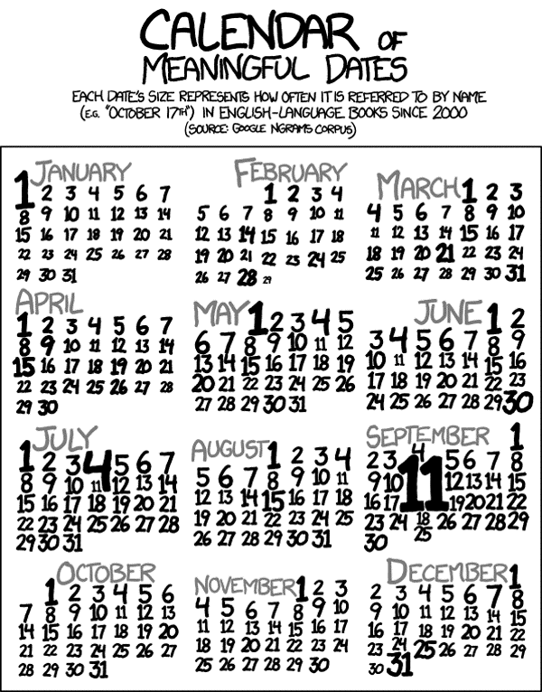
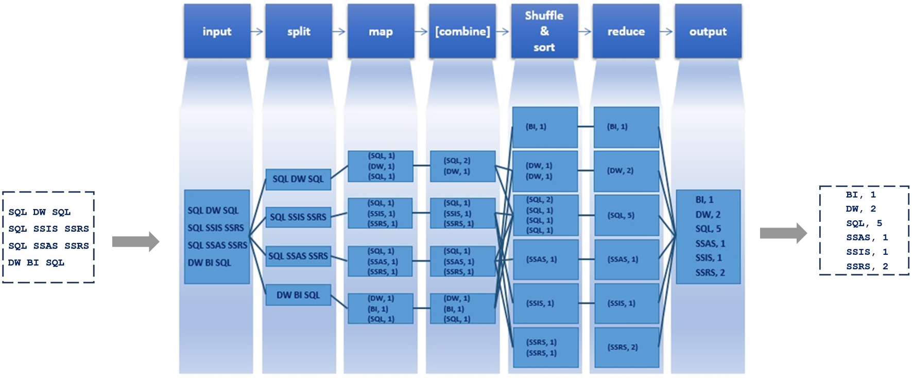

Wordcount with mapreduce()
========================================================
author: Andrie de Vries & Simon Field
date: 2015-07-01, UseR!2015
width: 1680
height: 1050
css: css/custom.css

hdfs
====
type: section

What is the Hadoop dfs?
=======================

* Distributed file system
* Automatic redundancy
* Designed for large volumes of data, written once, read frequently
* Individual files get split across nodes

rhdfs function overview
=======================

* Initialize
  - `hdfs.init()`
  - `hdfs.defaults()`
* File and directory manipulation
  - `hdfs.ls()`
  - `hdfs.delete()`
  - `hdfs.mkdir()`
  - `hdfs.exists()`
* Copy and move from local <-> HDFS
  - `hdfs.put()`
  - `hdfs.get()`

***

* Manipulate files within HDFS
  - `hdfs.copy()`
  - `hdfs.move()`
  - `hdfs.rename()`
* Reading files directly from HDFS
  - `hdfs.file()`
  - `hdfs.read()`
  - `hdfs.write()`
  - `hdfs.flush()`
  - `hdfs.seek()`
  - `hdfs.tell(con)`
  - `hdfs.close()`
  - `hdfs.line.reader()`
  -  `hdfs.read.text.file()`


Exercise-3.R
============

* Download a book from Project Gutenberg to the local file system.
* Then put the file in hdfs using `hdfs.put()`

Word count
==========



***

* Word count is the archetypal `hello world!` in Hadoop
* The mapper splits text into individual words and counts occurrences
* Reducer computes total across all mappers


Map Reduce Word Count Example
=============================



Exercise-4.R
============


Write a standard R script to count the number of words in the ebook you downloaded (use the local file system).

Don't use mapreduce just yet!


Exercise-5.R
============

Now complete the wordcount using `mapreduce()`


Demo 2
======


```r
groups <- rbinom(32, n = 50, prob = 0.4)
tapply(groups, groups, length)
```

```
 8  9 10 11 12 13 14 15 16 18 
 2  3  6  7  9  3  7  6  5  2 
```

Demo 2
======


```r
dfs.groups <- to.dfs(groups)

x <- mapreduce(input = dfs.groups,
               map = function(., v) keyval(v, 1),
               reduce = function(k, vv) keyval(k, length(vv))
)

y <- from.dfs(x)

as.data.frame(y)[order(y[["key"]]), ]
```

```
   key val
9    8   2
5    9   3
8   10   6
3   11   7
2   12   9
10  13   3
6   14   7
4   15   6
1   16   5
7   18   2
```

Demo 2
======


End
===
type: section

Thank you.
